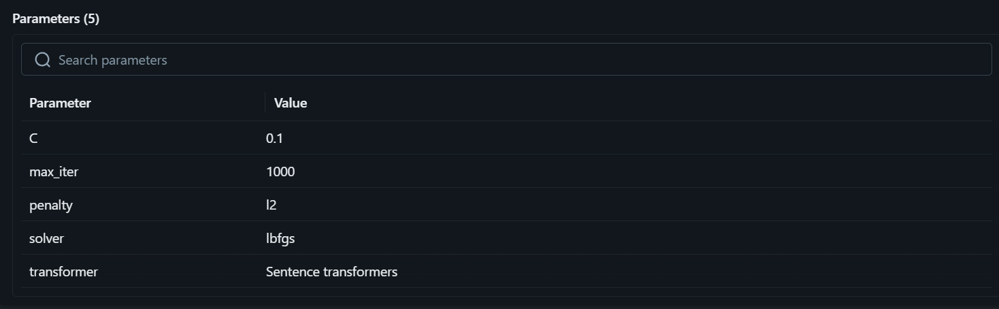
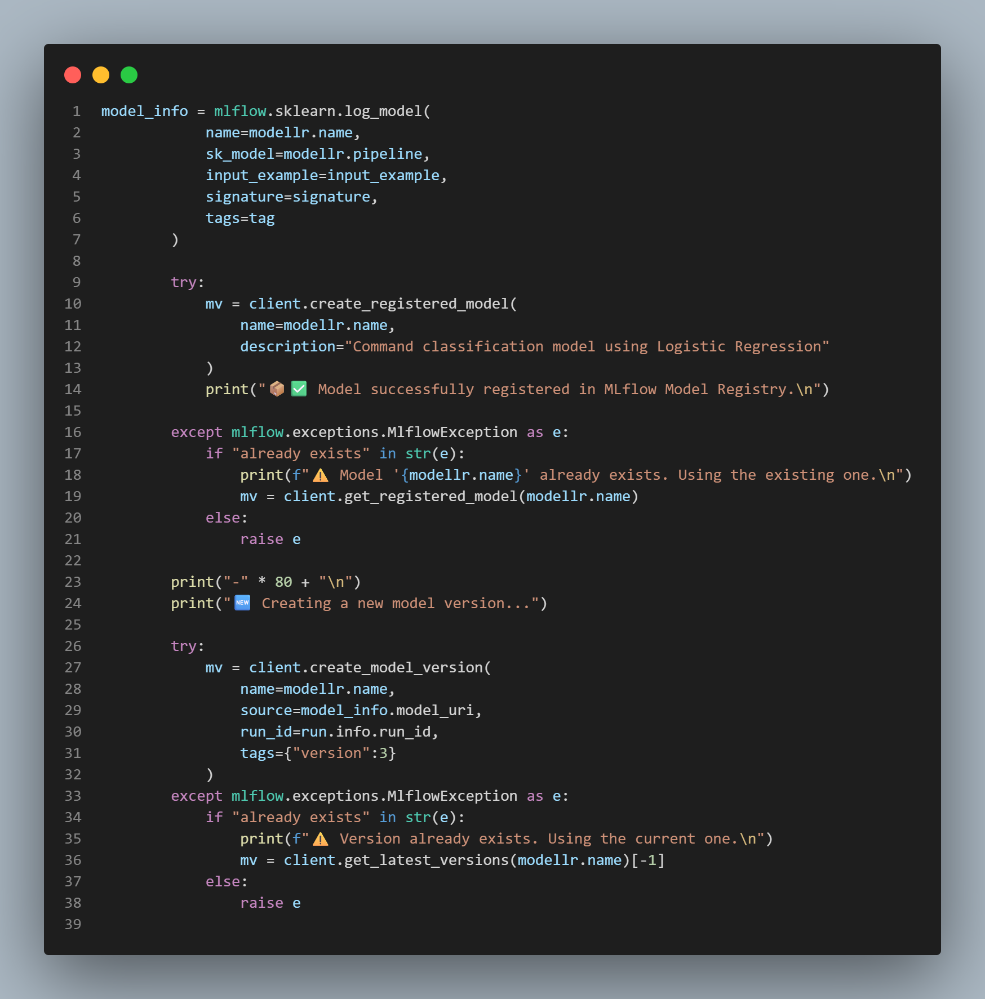
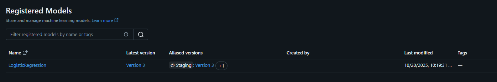
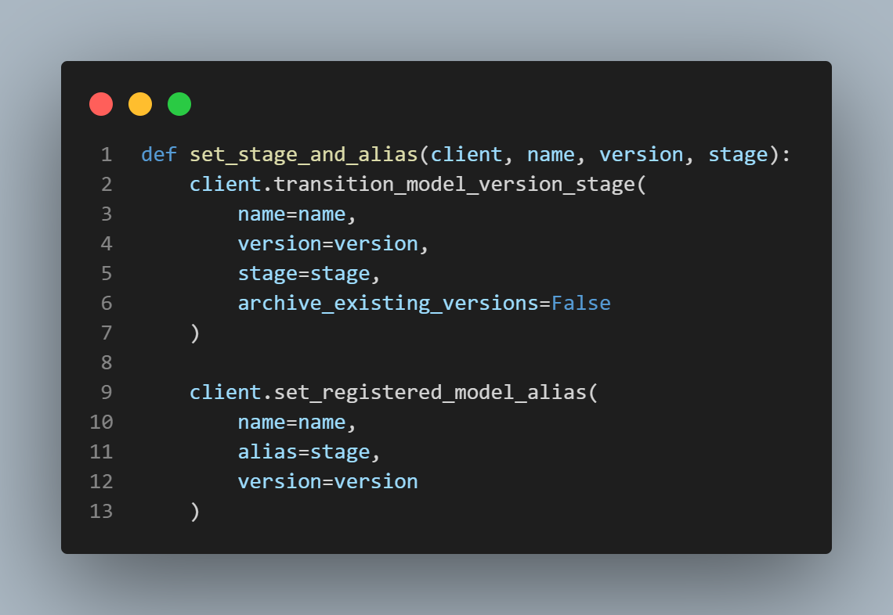
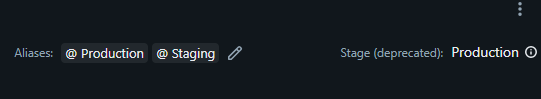
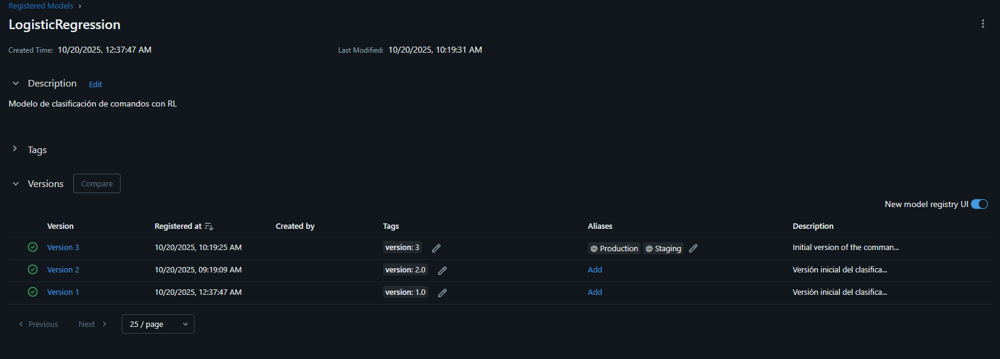

# 🧠 Command Classifier with Logistic Regression and MLflow tracking

    

---

# 🚀 Project Overview

This project was developed as a practical exercise for **Machine Learning model tracking and deployment** using **MLflow**.
It focuses on building a complete ML pipeline, from preprocessing to model registration and production deployment.

### Key Learning Objectives

## 1. Train a **Logistic Regression model** using example data (`scikit-learn`).
## 2. Log model **hyperparameters** (`C`, `regularization`, `solver`) and **metrics** (`accuracy`, `f1-score`) with MLflow.

### Hyperparameters

<div style="text-align: center;">
   
</div>

### Metrics

<div style="text-align: center;">
   
</div>

## 3. Use `mlflow.sklearn.log_model()` to **save and version** the trained model.

### code

<div style="text-align: center;">
   
</div>

## 4. Register the model in the **MLflow Model Registry** with a unique name.

### Model

<div style="text-align: center;">
   
</div>

## 5. Promote the model across lifecycle stages:

   ```
   None → Staging → Production
   ```

### Stage transition

<div style="text-align: center;">
   
</div>

### Stage transition in MLFLOW UI

<div style="text-align: center;">
   
</div>

## 6. Observe model versions, descriptions, and performance metrics in the MLflow UI.

### versions with descriptions

<div style="text-align: center;">
   
</div>

---

## 🧩 Project Structure

```
📁 command-classifier/
│
├── Data.py                     # Data loading, cleaning, label encoding
├── Transformer.py              # Text vectorization using Sentence Transformers
├── Model.py                    # Logistic Regression + embedding pipeline
├── DecodedPipelineWrapper.py   # Adds decoding + probability utilities to the pipeline
├── main.py                     # Full MLflow lifecycle: training → logging → registry
├── Nova.py                     # Loads the trained .pkl model and performs live predictions
├── test_model.py               # Interactive CLI for testing commands with Nova
├── commands_dataset.csv        # Example dataset with text and intents
└── README.md                   # Project documentation

```

---

## 🔍 Component-by-Component Explanation

### 1️⃣ **`Data.py` – Data Loading & Preprocessing**

This module is responsible for **loading**, **validating**, and **preprocessing** the dataset.

#### Key Features:

* Loads CSV data containing:

  ```
  text | command | intent
  ```
* Cleans text (lowercase, removes accents, punctuation, and extra spaces)
* Creates a unified **label column** (`command + intent`)
* Encodes labels using `LabelEncoder`
* Handles errors gracefully (missing file, empty CSV, wrong format)

#### Example Output:

```
✅ Dataset successfully loaded and processed.
Columns: text, label
```

---

### 2️⃣ **`Transformer.py` – Sentence Transformer Vectorization**

This module provides the **text embedding layer** using **Sentence Transformers**.

#### Key Class: `SentenceTransformerVectorizer`

* Wraps `SentenceTransformer` from `sentence-transformers` library.
* Uses the model: `'paraphrase-multilingual-mpnet-base-v2'`.
* Automatically detects and uses **GPU** if available.
* Produces dense numerical embeddings from input text.

#### Example:

```python
from Transformer import SentenceTransformerVectorizer
vectorizer = SentenceTransformerVectorizer()
embeddings = vectorizer.transform(["turn off the computer"])
print(embeddings.shape)  # (1, 768)
```

---

### 3️⃣ **`Model.py` – Model Pipeline & Training**

Defines the **Logistic Regression** model integrated with the transformer-based vectorizer.

#### Pipeline Architecture:

```
[ SentenceTransformerVectorizer ] → [ LogisticRegression ]
```

#### Training Process:

1. Loads cleaned text and encoded labels via `Data.py`
2. Splits data (80% train / 20% test)
3. Builds pipeline and trains model
4. Evaluates performance using:

   * Accuracy
   * Precision
   * Recall
   * F1-score
5. Saves model as `.pkl` for production usage

#### Output Example:

```
🏋️  MODEL TRAINING STARTED
🎯 Accuracy: 0.9423
🏆 F1 Score (weighted): 0.9371
✅ Model successfully trained.
💾 Model saved as model.pkl
```

---

### 4️⃣ **`DecodedPipelineWrapper.py` – Human-Readable Prediction Layer**

A lightweight wrapper to ensure the model returns **decoded labels** (instead of numeric classes) and **prediction probabilities**.

#### Class: `DecodedPipelineWrapper`

* Takes the trained pipeline and fitted `LabelEncoder`
* Provides:

  * `predict(order)` → returns decoded label (string)
  * `probability(order)` → returns confidence in %

#### Example:

```python
decoded_model = DecodedPipelineWrapper(pipeline, label_encoder)
command = "Play music at 6"
prediction = decoded_model.predict(command)
confidence = decoded_model.probability(command)
print(prediction, confidence)
# Output: "play music scheduled" , 97.25%
```

---

### 5️⃣ **`main.py` – MLflow Orchestration**

This script handles the **entire model lifecycle** using MLflow:

* Experiment tracking
* Parameter and metric logging
* Model registration
* Versioning and stage transition

#### Workflow:

1. Initializes MLflow experiment
2. Defines model parameters
3. Trains the pipeline via `ModelLR`
4. Logs all parameters, metrics, and artifacts
5. Registers and promotes model to **Production**

#### Key Features:

* Uses `infer_signature()` for schema consistency
* Automatically creates new model versions
* Promotes model from **Staging → Production**
* Assigns aliases for each stage

#### Example MLflow Console Output:

```
📦 REGISTERING MODEL IN MLFLOW MODEL REGISTRY
✅ Model version successfully created.
🚀 Model successfully moved to 'Production' stage.
🎯 FULL PROCESS COMPLETED SUCCESSFULLY
```

#### Logged Artifacts:

| Type           | Description                         |
| -------------- | ----------------------------------- |
| **Parameters** | Logistic Regression hyperparameters |
| **Metrics**    | Accuracy, F1-score, training time   |
| **Artifacts**  | Dataset, pickled model              |
| **Tags**       | Version, model type, author info    |

---

### 6️⃣ **`Nova.py` – Model Loader & Inference Interface**

`Nova` acts as a **lightweight production client** to load and use the trained model.

#### Workflow:

* Loads `.pkl` model generated by `ModelLR`
* Handles missing/corrupted models gracefully
* Predicts commands using the decoded pipeline
* Returns both prediction and confidence score

#### Example Usage:

```python
from Nova import Nova
model = Nova("model.pkl")
prediction, confidence, time = model.predict("open chrome browser")
print(prediction, confidence)
```

#### Output:

```
🧠 Predicted Command: open chrome immediate
📈 Confidence: 98.6%
⏱️ Inference Time: 0.128s
```

---

### 7️⃣ **`test_model.py` – Interactive CLI Application**

Provides a **terminal interface** to interact with the deployed model.

#### Features:

* Loads the trained model automatically
* Takes user input command
* Displays prediction, probability, and latency
* Type `exit` to quit the program

#### Example Console:

```
🌌  WELCOME TO NOVA'S COMMAND CLASSIFIER  🌌
👉 Enter a command: Turn off the PC

🧠 Detected Command  :  turn off computer immediate
📈 Confidence Level  :  96.73%
⏱️  Processing Time   :  0.1423 seconds
```

---

## 🔄 End-to-End Workflow Summary

| Stage                       | Description                          | Script           |
| --------------------------- | ------------------------------------ | ---------------- |
| **1. Data Preprocessing**   | Clean, encode, and validate dataset  | `Data.py`        |
| **2. Embedding Generation** | Convert text to vector embeddings    | `Transformer.py` |
| **3. Model Training**       | Train LR classifier using embeddings | `Model.py`       |
| **4. Experiment Tracking**  | Log metrics, params, and artifacts   | `main.py`        |
| **5. Model Registration**   | Register, version, and promote model | `main.py`        |
| **6. Model Serving**        | Load and serve `.pkl` model          | `Nova.py`        |
| **7. CLI Prediction**       | Real-time command testing            | `test_model.py`  |

---

## 🧾 Example MLflow Registry Snapshot

| Model Name            | Version | Stage      | Accuracy | F1-score |
| --------------------- | ------- | ---------- | -------- | -------- |
| Nova_classifier_model | 3       | Production | 0.945    | 0.940    |

---

## 🧰 Dependencies

* Python ≥ 3.9
* `mlflow`
* `scikit-learn`
* `pandas`
* `numpy`
* `sentence-transformers`
* `torch`

Install requirements:

```bash
pip install -r requirements.txt
```

---

## 🧑‍💻 Author

**Camilo Ramos Cotes**
Software Engineer | Machine Learning Enthusiast
📧 [camutoxlive20@gmail.com](mailto:camutoxlive20@gmail.com)
🔗 ([https://github.com/Camiloramos2000](https://github.com/Camiloramos2000))

---

## 🏁 Final Outcome

After running this full pipeline, you will obtain:

✅ A **Logistic Regression command classifier**
🧩 Tracked, registered, and versioned in MLflow
🧠 Encoded with SentenceTransformer embeddings
🎯 Wrapped for decoded, human-readable predictions
🚀 Served through a CLI application (“Nova”)

> *“From dataset to production — every stage tracked and versioned with MLflow.”* ✨

