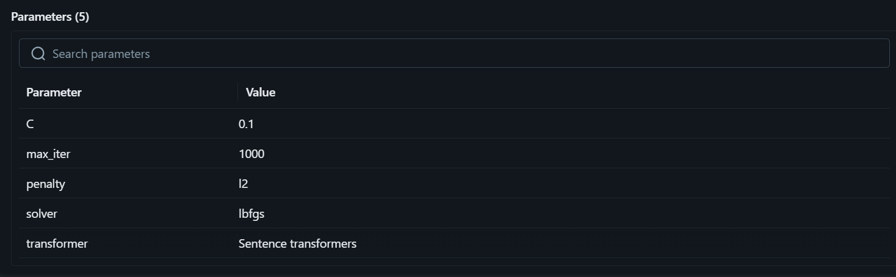
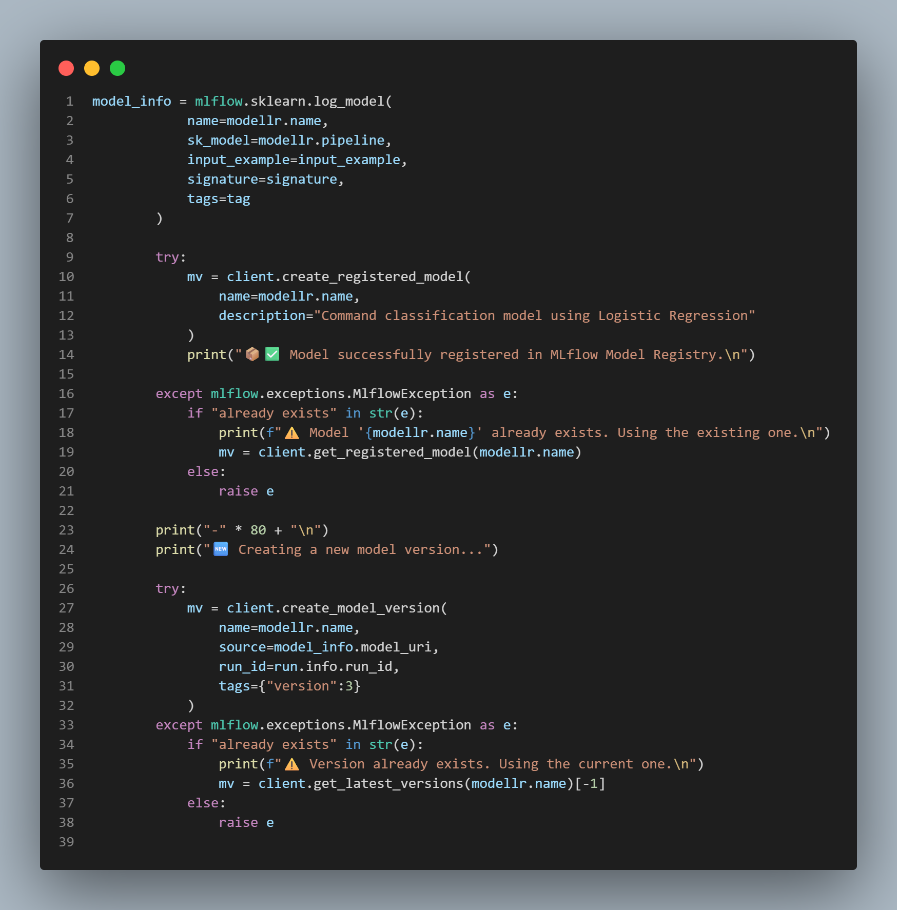
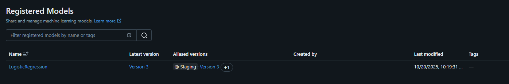
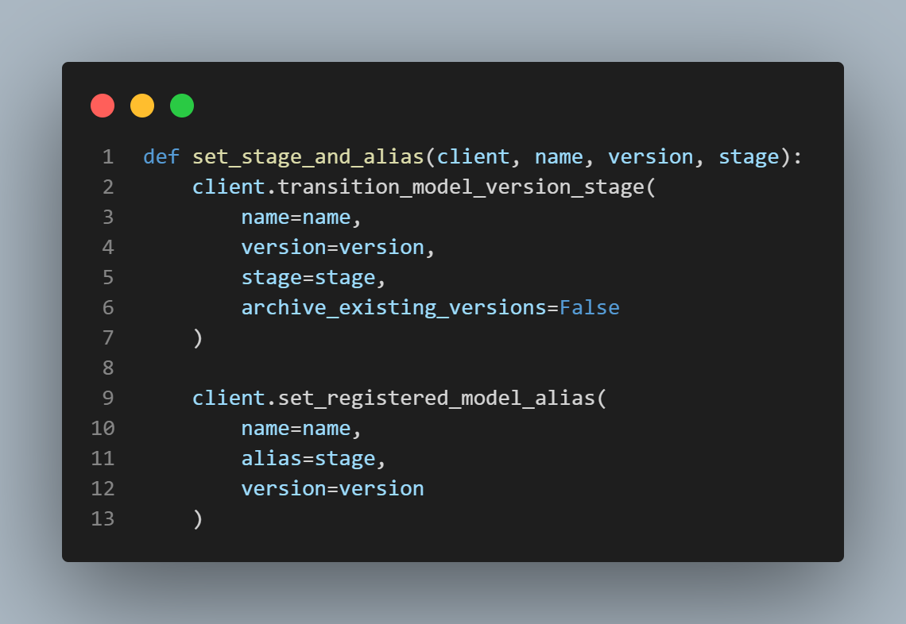
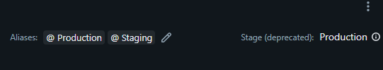
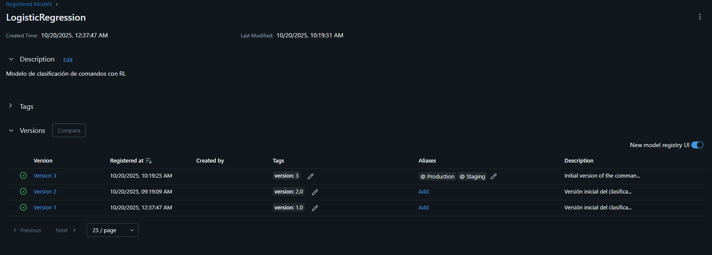

# 🧠 Command Classifier with Logistic Regression and MLflow Tracking

This project demonstrates how to build, train, and register a **command classification model** using **Logistic Regression** (or other classic ML models) and **MLflow** for experiment tracking and model lifecycle management.

The system is designed to classify computer commands (e.g., “turn off the PC”, “open Chrome”, “play music at 6”) based on their intent — either **immediate actions** or **scheduled actions** — by combining text processing, model training, and deployment tracking.

---

## 🚀 Project Overview

This project was developed as a practical exercise for **Machine Learning model tracking and deployment** using **MLflow**.  
It focuses on building a complete ML pipeline, from preprocessing to model registration and production deployment.

### Key Learning Objectives

1. Train a **Logistic Regression model** using example data (`scikit-learn`).
2. Log model **hyperparameters** (`C`, `regularization`, `solver`) and **metrics** (`accuracy`, `f1-score`) with MLflow.

# Hyperparameters

<div style="text-align: center;">
   
</div>

# Metrics
<div style="text-align: center;">
   
</div>

3. Use `mlflow.sklearn.log_model()` to **save and version** the trained model.
# code
<div style="text-align: center;">
   
</div>

4. Register the model in the **MLflow Model Registry** with a unique name.

# Model
<div style="text-align: center;">
   
</div>

5. Promote the model across lifecycle stages:
   ```
   None → Staging → Production
   ```

   
# Stage transition
<div style="text-align: center;">
   
</div>

# Stage transition in MLFLOW UI
<div style="text-align: center;">
   
</div>

6. Observe model versions, descriptions, and performance metrics in the MLflow UI.

# versions with descriptions
<div style="text-align: center;">
   
</div>

# versions with descriptions
<div style="text-align: center;">
   
</div>


---

## 🧩 Project Structure

```
📁 command-classifier/
│
├── Data.py             # Handles data loading, cleaning, and label encoding
├── Model.py            # Defines the ML model pipeline (vectorizer + classifier)
├── main.py             # Orchestrates training, evaluation, MLflow logging, and registry promotion
├── commands_dataset.csv # Example dataset with text commands, labels, and intents
└── README.md           # Project documentation
```

---

## ⚙️ Main Components

### 1️⃣ Data Handling (`Data.py`)
- Loads and validates the dataset from CSV.
- Cleans text (lowercase, removes accents/symbols).
- Encodes labels using `LabelEncoder`.
- Combines columns `command` and `intent` into a unified label.

### 2️⃣ Model Pipeline (`Model.py`)
- Uses a **TF-IDF Vectorizer** to transform text into numerical features.
- Trains a **Logistic Regression** (or Naive Bayes) model for classification.
- Splits the data into training/testing sets and calculates:
  - `accuracy_score`
  - `f1_score`
  - training time
- Provides a `.test()` method for inference with new commands.

### 3️⃣ MLflow Integration (`main.py`)
- Starts an MLflow run and logs:
  - Parameters (`C`, `solver`, regularization type)
  - Metrics (`accuracy`, `f1_score`, inference time`)
  - Artifacts (dataset, model pipeline)
- Registers the trained model in the **Model Registry**.
- Promotes it to **Production** automatically.

---

## 📊 Example Metrics Logged in MLflow

| Metric          | Description |
|-----------------|--------------|
| **accuracy**     | Model accuracy on test data |
| **f1-score**     | Weighted harmonic mean of precision and recall |
| **train_time**   | Duration of the training phase |
| **prediction_proba** | Model’s confidence in its prediction |

---

## 🧱 Example Workflow

1. **Run the main script:**
   ```bash
   python main.py
   ```
2. **MLflow will:**
   - Start a new run
   - Train the model
   - Log parameters and metrics
   - Register the model in the Model Registry
   - Promote it to “Production”

3. **Check results in the MLflow UI:**
   ```bash
   mlflow ui
   ```
   Navigate to: `http://localhost:5000`

4. You will see:
   - Model versioning
   - Training metrics and parameters
   - Production-ready registered model

---

## 🧠 Example Output

```
✅ Training completed successfully
📈 accuracy_score: 0.9456
🎯 f1_score: 0.9402
💾 Model registered in MLflow Model Registry
🚀 Model promoted to Production stage
```

---

## 🧰 Requirements

- Python ≥ 3.9
- scikit-learn
- pandas
- mlflow
- numpy

Install dependencies:
```bash
pip install -r requirements.txt
```

---

## 🧑‍💻 Author

**Camilo Ramos Cotes**  
Software Engineer | Machine Learning Enthusiast  
📧 camutoxlive20@gmail.com  
🔗 (https://github.com/Camiloramos2000)

---

## 🏁 Expected Result

After running this project, you will have a **versioned and production-ready ML model** in MLflow, complete with:
- Registered hyperparameters and metrics  
- Dataset artifact  
- Full model lifecycle management  

This serves as a solid template for building, tracking, and deploying classic ML models in production environments.

---

### 📦 Example Registry Stages

| Stage | Description |
|--------|-------------|
| **None** | Model freshly trained, not yet reviewed |
| **Staging** | Under testing or validation |
| **Production** | Active model used in production |
| **Archived** | Old or deprecated versions |

---

> _"Track experiments, version models, and manage lifecycles — all with MLflow."_ ✨
